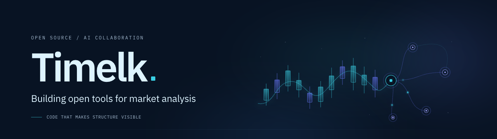

<!-- This repository powers github.com/Timelk. -->

  
  

## Hi, I'm Timelk.

I build interactive tools that make market data easier to explore.

Currently building **[open-tradingview](https://github.com/Timelk/open-tradingview)** — fluid crypto charts, native market analysis, and editable annotations with your own AI Agent.

**WebGL · Svelte · TypeScript · MCP**

[**Quick start**](https://github.com/Timelk/open-tradingview#quick-start) · [中文介绍](https://github.com/Timelk/open-tradingview/blob/main/README.zh-CN.md) · [Website](https://viberules.app)

---

我正在把自己的加密货币分析工作台逐步开源：先打磨图表交互、原生分析与 AI 协作，再推进更多功能。
